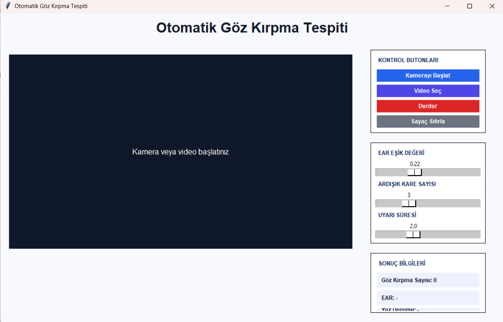
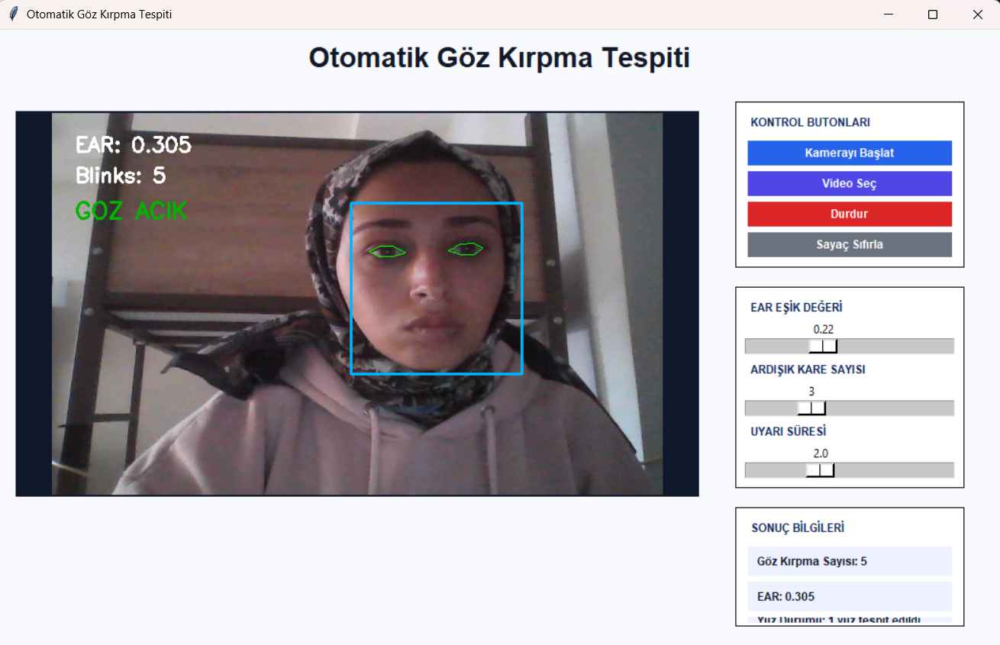
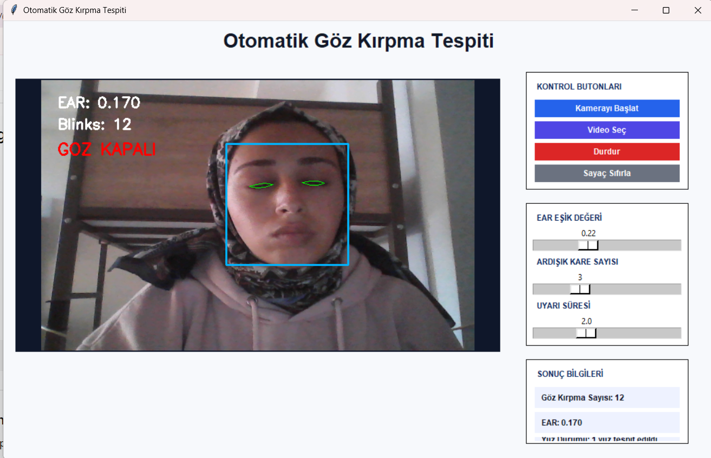
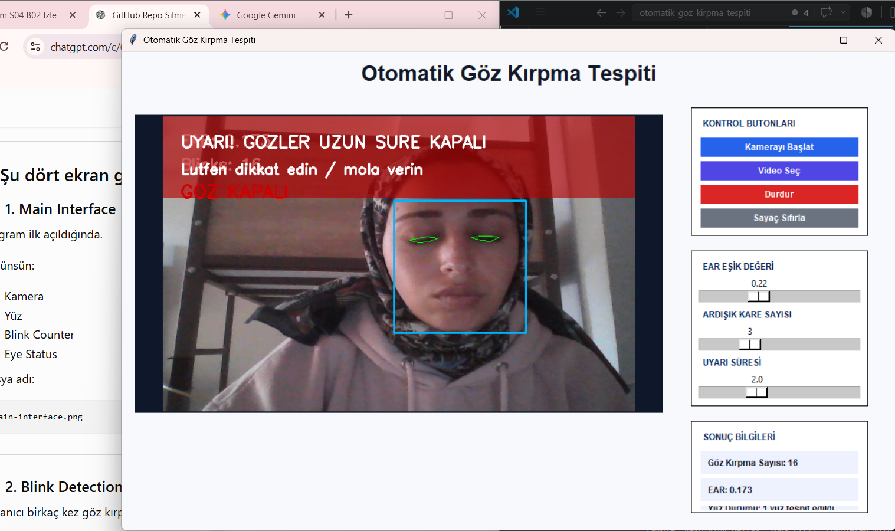

# 👁️ Real-Time Eye Blink & Drowsiness Warning System


A real-time eye blink and prolonged eye closure detection system developed using **OpenCV**, **dlib**, and **Eye Aspect Ratio (EAR)** analysis.

The application continuously monitors the user's eye status through a webcam, detects eye blinks, counts total blinks, and automatically triggers both an on-screen warning and an audible alarm whenever the eyes remain closed for an unsafe duration.

---

# 📑 Table of Contents

- Overview
- Features
- System Architecture
- Detection Logic
- Eye Aspect Ratio (EAR)
- Technologies
- Project Structure
- Installation
- Screenshots
- Applications
- Future Improvements
- Author
- License

---

# 📌 Overview

Eye blink detection is one of the most widely used applications of computer vision and facial landmark analysis. Besides detecting normal blinks, monitoring prolonged eye closure is essential for identifying fatigue and loss of attention.

This project performs real-time eye monitoring using a webcam. Facial landmarks are detected with **dlib's 68-point facial landmark model**, and the **Eye Aspect Ratio (EAR)** is continuously calculated for both eyes.

The system provides four main functionalities:

- Detects whether the eyes are open or closed
- Counts the total number of eye blinks
- Detects prolonged eye closure
- Activates both an on-screen warning and an audible alarm when prolonged eye closure is detected

The project has been designed as a lightweight and real-time computer vision application that can serve as a foundation for driver drowsiness detection and attention monitoring systems.

---

# 🚀 Features

- 👁️ Real-time eye state detection (Open / Closed)
- 🔢 Real-time blink counting
- 📍 68 facial landmark detection
- 📐 Eye Aspect Ratio (EAR) calculation
- ⚠️ Long eye closure detection
- 🚨 Warning screen
- 🔊 Audible alarm notification
- 🎥 Live webcam monitoring
- ⚡ Fast real-time processing
- 💻 Lightweight Python implementation

---

# 🏗️ System Architecture

```text
               Webcam
                  │
                  ▼
          Face Detection
                  │
                  ▼
   68 Facial Landmark Detection
                  │
                  ▼
      Eye Region Extraction
                  │
                  ▼
   Eye Aspect Ratio (EAR)
                  │
          ┌───────┴────────┐
          ▼                ▼
 Blink Detection     Eye Closed?
          │                │
          ▼                ▼
 Blink Counter     Closed Duration
                           │
                 ┌─────────┴─────────┐
                 ▼                   ▼
           Normal Blink      Long Eye Closure
                                      │
                                      ▼
                           Warning Screen
                                      │
                                      ▼
                               Audible Alarm
```

---

# 🎯 Detection Logic

The application continuously evaluates the Eye Aspect Ratio (EAR).

- If the EAR temporarily falls below the threshold, the event is recognized as a normal blink.
- Each blink is counted automatically.
- If the EAR remains below the threshold for a predefined duration, the application considers it as prolonged eye closure.
- A warning message immediately appears on the screen.
- At the same time, an audible alarm is activated to alert the user.

---

# 👁️ Eye Aspect Ratio (EAR)

The Eye Aspect Ratio (EAR) is a geometric measurement calculated from six facial landmark points around each eye.

The EAR decreases when the eyes close and increases when they reopen.

This lightweight mathematical approach enables fast and reliable blink detection without requiring deep learning inference during runtime.

---

# 🛠️ Technologies Used

| Technology | Purpose |
|------------|---------|
| Python | Main programming language |
| OpenCV | Image processing |
| dlib | Face & facial landmark detection |
| NumPy | Numerical computations |
| Computer Vision | Real-time image analysis |

---

# 📂 Project Structure

```text
real-time-eye-blink-drowsiness-warning/
│
├── models/
│   └── shape_predictor_68_face_landmarks.dat
│
├── app.py
├── README.md
├── proje_aciklamasi.md
├── requirements.txt
└── .gitignore
```

---

# ⚙️ Installation

Clone the repository

```bash
git clone https://github.com/beyzanurrr/real-time-eye-blink-detection.git
```

Move into the project folder

```bash
cd real-time-eye-blink-detection
```

Install dependencies

```bash
pip install -r requirements.txt
```

Run the application

```bash
python app.py
```

---

# 📸 Screenshots

## Application Interface

The main graphical user interface allows users to start the webcam or select a video, adjust detection parameters, and monitor blink statistics in real time.



## Eye Open Detection

The system successfully detects the user's face and continuously monitors the eye status. The Eye Aspect Ratio (EAR), blink count, and current eye state are displayed in real time.



## Eye Closed Detection

When the eyes are closed, the Eye Aspect Ratio decreases below the predefined threshold. The application identifies the eye state as closed while continuing to monitor the duration of closure.



## Drowsiness Warning

If the eyes remain closed for a predefined duration, the application detects prolonged eye closure and immediately activates both a visual warning message and an audible alarm to alert the user.




# 📦 Model File

This project uses the **dlib 68 Facial Landmark Predictor**.

```
shape_predictor_68_face_landmarks.dat
```

The model file is located inside the **models** directory.

---

# 🎯 Applications

This project can be adapted for numerous real-world applications:

- 🚗 Driver Drowsiness Detection
- 🧠 Fatigue Monitoring
- 👀 Attention Tracking
- 🤝 Human–Computer Interaction
- 🏥 Healthcare Monitoring
- ♿ Assistive Technologies
- 📚 Academic Research
- 🎓 Computer Vision Education

---

# 🚀 Future Improvements

- Multiple face support
- Blink frequency analysis
- Driver fatigue score calculation
- EAR visualization graph
- Video file processing
- Mobile application support
- Deep learning based face detector
- Performance optimization

---

# 📈 Advantages

- Lightweight implementation
- Real-time performance
- High detection accuracy
- Easy deployment
- Low hardware requirements
- Easy integration into larger projects

---

# 👩‍💻 Author

**Beyza Nur Karabudak**

Computer Engineering

Tekirdağ Namık Kemal University

Turkey

---

# 🤝 Contributing

Contributions, suggestions, and improvements are always welcome.

Feel free to fork the repository and submit a pull request.

---

# ⭐ Support

If you found this project useful, please consider giving it a ⭐ on GitHub.

---

# 📜 License

This project is licensed under the MIT License.